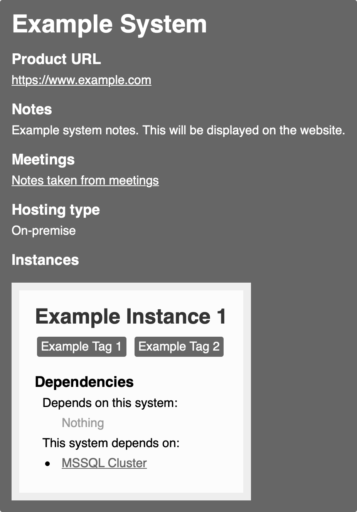
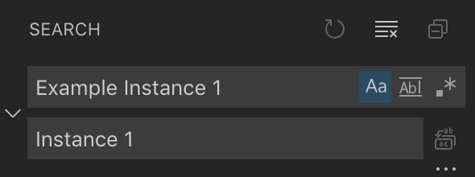

# Cloud Migration - System Inventory Tool

## Table of Contents

- [Overview](#overview)
- [Getting Started](#getting-started)
  - [Installing for the first time](#installing-for-the-first-time)
  - [Local development](#local-development)
  - [Docker](#docker)
- [Usage](#usage)
  - [Adding a system](#adding-a-system)
  - [Adding an image](#adding-an-image)
  - [Naming an instance](#naming-an-instance)
- [License](#license)

## Overview

This tool is designed to help you gather all of your systems in one presentable dashboard for the purpose of cloud migration. It utilises [Jekyll](https://jekyllrb.com) which is a static site generator written in the [Ruby](https://www.ruby-lang.org) programming language.

## Getting Started

There are a couple of dependencies required to get started. Ensure you have the following installed:

- [Ruby](https://www.ruby-lang.org)
  - [Bundler](https://bundler.io) to install dependencies found in `Gemfile`
  - [Jekyll](https://jekyllrb.com) to generate static site
- [Docker](https://www.docker.com) (_optional_)
  - You will need this if you do not want to locally install Ruby on your machine and/or if you want to deploy your website
- [Git](https://git-scm.com) (_optional_)

### Installing for the first time

Use `Git` to clone the repository, or alternatively download ZIP. We will use `Git` here for the purpose of this short guide.

```bash
$ git clone https://github.com/madetech/system-inventory
$ cd system-inventory
```

### Local development

Once you are in the `system-inventory` directory, you can install the dependencies via Bundler.

```bash
$ gem install bundler #if you do not already have bundler installed
$ bundle install
```

After everything has been installed, run the following command:

```bash
$ bundle exec jekyll serve
```

### Docker

Simply run the following command if you wish to use Docker:

```bash
./bin/jekyll serve
```

## Usage

Browse to http://localhost:4000 to see your system inventory site.

### Adding a system

There are a few examples of different types of systems in the `_systems` folder. To add a system, you create another Markdown file (`.md`). Use the content below as an example (`example_system.md`):

```ruby
---
name: Example System
hosted: on_prem
lifespan: migrating
product_url: https://www.example.com/
instances:
- name: Instance 1
  owner: Owner 1
  tags:
  -  Example Tag 1
  -  Example Tag 2
  notes: Example Notes
  dependencies:
   - MSSQL Cluster
---

Example system notes. This will be displayed on the website.
```
For the above example, the following image shows how the information will be displayed on the website.



#### System content breakdown:

- **`name`:** This is the name of your system
- **`archetype`:** You can optionally choose to define an archetype, especially useful if you want to categorise your systems - some of the existing options are `special`, `desktop`, `unknown`, `onsite`, `agnostic-web` and `windows-web`
- **`hosted`:** `on_prem` is displayed as `On-premise` as shown above. You can change this, if necessary
- **`lifespan`:** There are a few options - `migrating`, `eol` (end of life) and `ongoing`
- **`product_url`:** This is the link to the website of the system
- **`instances`:**
  - **`name`:** This is the name of your instance, so wherever the system is currently being used
  - **`owner`:** This information is not displayed on the site, but can be useful to know
  - **`tags`:** You can add as many tags as you want, ensure they are on a new line as shown in the example above
  - **`notes`:** These notes are for your own use and are not displayed on the site
  - **`dependencies`:** This is where you state what `this system depends on` (i.e. MSSQL Cluster for the above example)
- The notes for the system are entered at the bottom, below the `---` line

_Note:_ the `---` at the top and at the bottom of the `.md` file is necessary for Jekyll to generate the site. Refer to the other systems as guidance.

### Adding an image

There is a `Meetings` section in the image shown above. This displays a link to an image which will be automatically generated if the filename of a system is the same as the filename of the image.

Continuing with the example from above, the `example_system.md` is located in the `_systems` folder.

Navigate to `assets/images` and this is where you will want to upload your images from meetings, workshops, etc. For the link to be displayed, the filename of the image must correspond to `example_system.jpg`. Keep in mind that the images will need to have the **.jpg** extension.

### Naming an instance

To ensure instances are named correctly in order to be displayed on the site, you will want to **find all** occurrences using your preferred text editor of the instance and **match case**. Then, you can proceed to change all occurrences at once. If using [Visual Studio Code](https://code.visualstudio.com), refer to the image below.



## License

Attribution-ShareAlike 4.0 International: The licensor permits others to copy, distribute, display, and perform the work. In return, licensees must give the original author credit. See [LICENSE](./LICENSE).

###### Made Tech &copy; 2019
